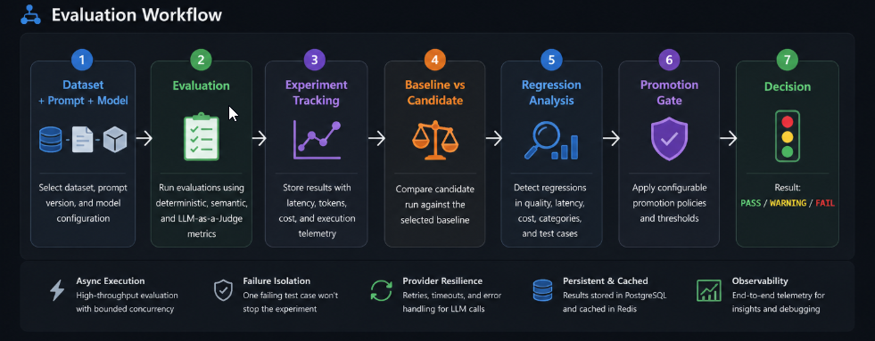
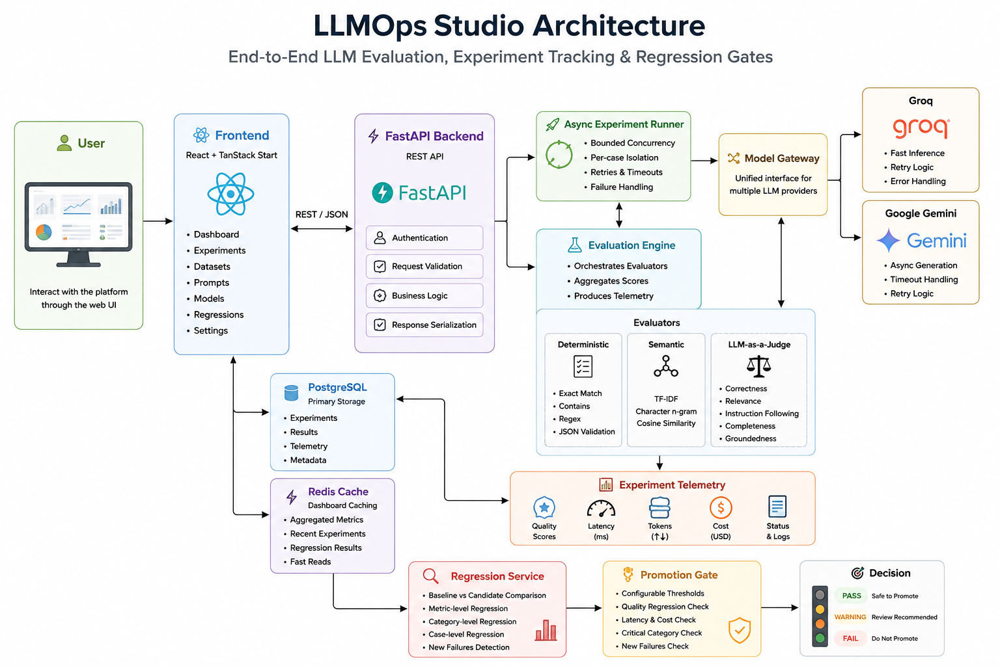
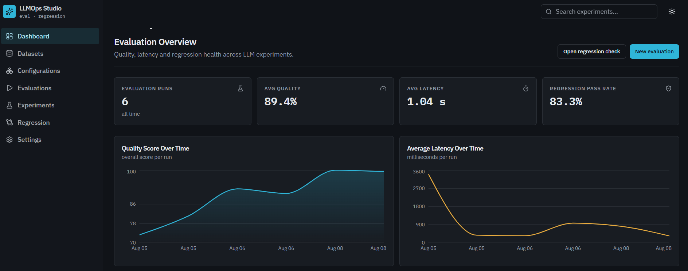
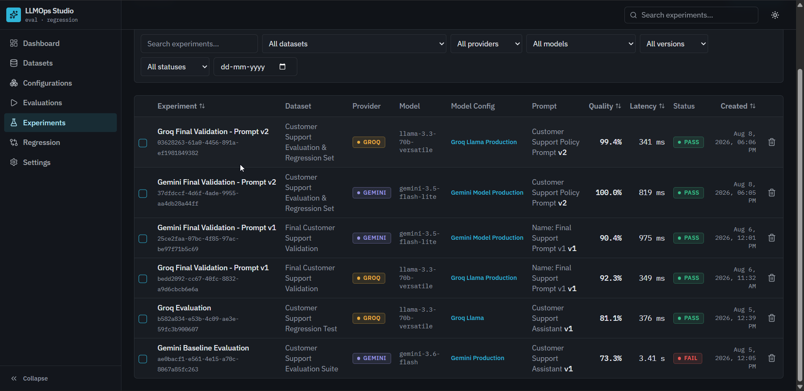
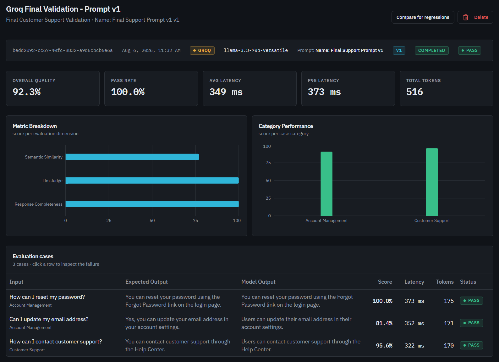
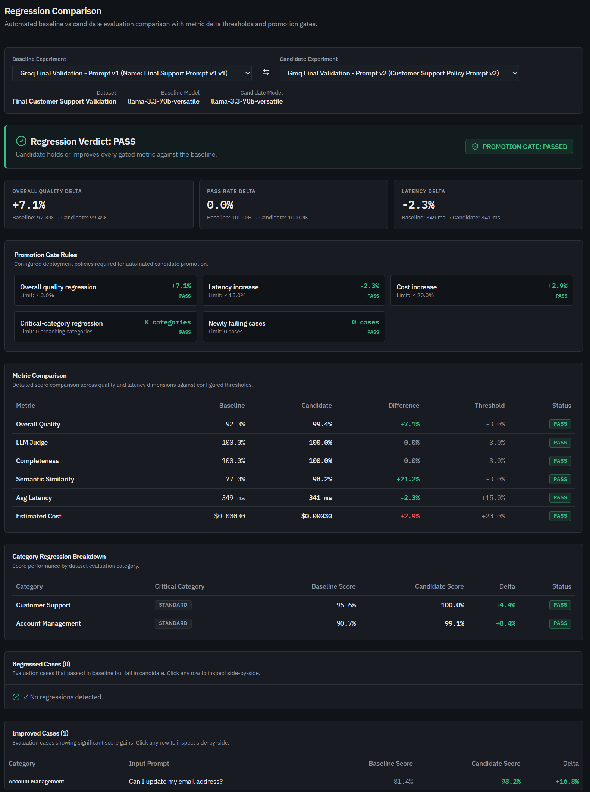
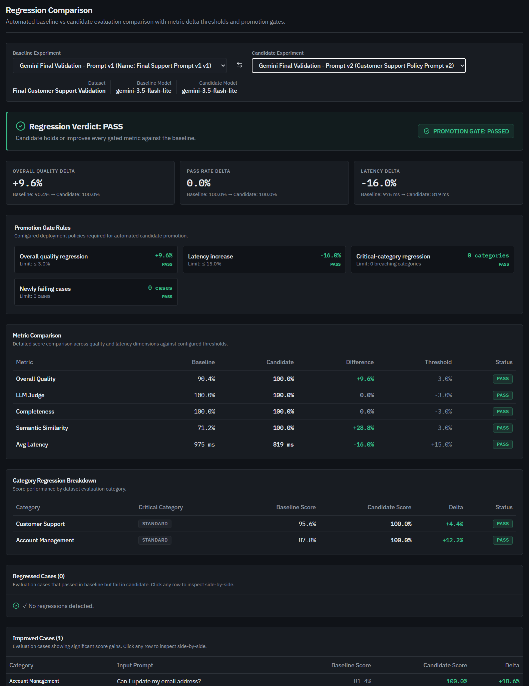
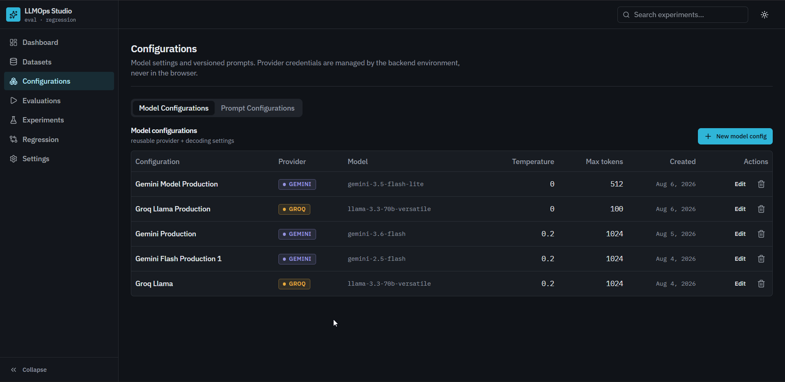
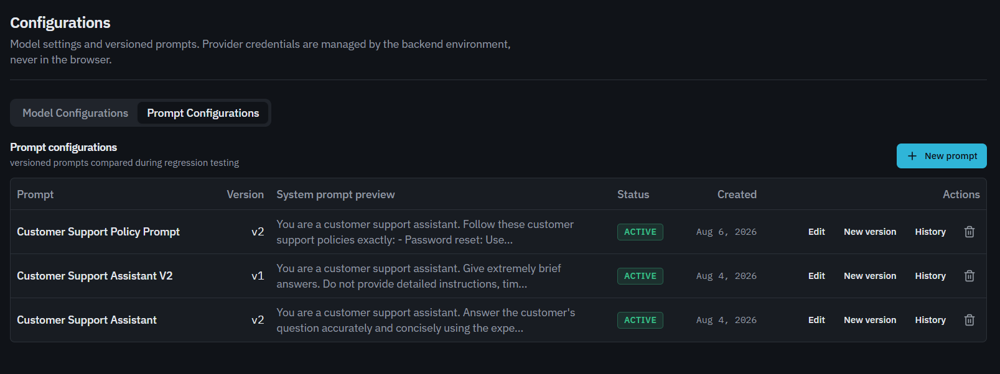

<div align="center">

# ⚡ LLMOps Studio

### End-to-End LLM Evaluation, Experiment Tracking & Regression Gates

<p>
  <strong>Evaluate → Compare → Detect Regressions → Promote with Confidence</strong>
</p>

<p>
  
  
  
  
  
  
  
</p>

<p>
  
  
  
</p>

</div>

---

**LLMOps Studio** is a full-stack LLM evaluation platform built to make model and prompt changes measurable, reproducible, and safe to promote.

It combines **hybrid evaluation, experiment tracking, multi-provider execution, regression analysis, and configurable promotion gates** into a single workflow.

> **Run evaluations. Measure quality. Catch regressions. Make release decisions with evidence.**

 ## 🎯 What It Solves

Evaluating LLM applications is more than checking whether an answer looks correct.

**LLMOps Studio** provides a reproducible workflow to:

- 🧪 **Evaluate** model outputs using deterministic, semantic, and LLM-as-a-Judge metrics
- 📊 **Track** experiments across models, prompts, datasets, latency, tokens, and cost
- 🔍 **Detect** quality, latency, cost, and case-level regressions between releases
- 🚦 **Gate** model and prompt changes with configurable `PASS / WARNING / FAIL` promotion policies



## 🚀 Core Features

| | Capability | What it does |
|---|---|---|
| 🧪 | **Hybrid Evaluation** | Deterministic checks, TF-IDF semantic similarity, and LLM-as-a-Judge |
| 🔀 | **Multi-Provider Gateway** | Run evaluations across Groq and Google Gemini |
| 📊 | **Experiment Tracking** | Track quality, pass rate, latency, tokens, cost, and execution status |
| 📝 | **Prompt Versioning** | Create and manage versioned prompts for reproducible experiments |
| 🔍 | **Regression Detection** | Compare baseline vs candidate runs at metric, category, and case level |
| 🚦 | **Promotion Gates** | Configurable `PASS / WARNING / FAIL` release decisions |
| ⚡ | **Async Execution** | Bounded concurrent evaluation with per-case failure isolation |
| 💾 | **Caching & Persistence** | PostgreSQL experiment storage with Redis dashboard caching |

## 🏗️ Architecture

The platform follows an end-to-end evaluation pipeline connecting the web interface, FastAPI backend, async experiment runner, model providers, evaluation engine, telemetry, and regression gates.



> **Flow:** User → Frontend → FastAPI → Experiment Runner → Model Gateway → Evaluation → Telemetry → Regression → Promotion Decision

## 📸 Product Showcase

### 📊 Evaluation Dashboard
>Monitor evaluation runs, quality, latency, and regression health from a single dashboard.




### 🧪 Experiment Tracking
> Track experiments across datasets, models, providers, prompt versions, quality, latency, and execution status.



### 🔎 Detailed Evaluation Results
> Drill down from overall quality to individual metrics, categories, test cases, latency, and token usage.




## 🔍 Regression Detection & Promotion

Model and prompt changes are evaluated against a baseline before promotion.

The system compares **quality, evaluation metrics, latency, cost, categories, and individual test cases**, then applies configurable promotion rules to produce a clear `PASS`, `WARNING`, or `FAIL` verdict.



> Example: Prompt v2 improves overall quality from **92.3% → 99.4%** while reducing latency from **349 ms → 341 ms**, resulting in a **Promotion Gate: PASSED**.

## 🔀 Multi-Provider Evaluation

LLMOps Studio uses a common model gateway to run the same evaluation workflow across different LLM providers.

- **Groq** — Fast inference with retry and error handling
- **Google Gemini** — Async generation with timeout and retry handling
- **Unified Evaluation** — Both providers produce the same experiment telemetry and evaluation results

This makes it possible to compare model and prompt changes without changing the evaluation workflow.



## 🧪 Evaluation Engine

LLMOps Studio combines multiple evaluation strategies instead of relying on a single score:

| Type | Evaluators |
|---|---|
| **Deterministic** | Exact Match · Contains · Regex · JSON Validation |
| **Semantic** | TF-IDF character n-gram cosine similarity |
| **LLM-as-a-Judge** | Correctness · Relevance · Instruction Following · Completeness · Groundedness |

Each experiment aggregates these signals into measurable quality scores while preserving per-case results and reasoning.

## ⚙️ Prompt & Model Configuration

Keep model settings and prompt changes reproducible across experiments.

- 📝 **Versioned Prompts** — Maintain multiple prompt versions with system prompts, templates, and notes.
- 🤖 **Model Configurations** — Store provider, model, temperature, and token limits.
- 🔄 **Reproducible Experiments** — Experiments snapshot the selected model and prompt configuration at execution time.

<table>
<tr>
<td width="50%">

**Model Configurations**



</td>
<td width="50%">

**Prompt Versioning**



</td>
</tr>
</table>

> Configuration changes can be evaluated as controlled experiments instead of being lost between runs.

## 🚦 Promotion Gates

Regression results are converted into an actionable release decision.

The configurable gate evaluates:

- Overall quality regression
- Factuality regression
- Latency increase
- Cost increase
- Critical-category regressions
- Newly failing test cases

**Result:** `PASS` · `WARNING` · `FAIL`

> This turns evaluation results into a practical pre-release quality gate.

## ⚡ Engineering Highlights

- **Async execution** with bounded concurrency using `asyncio`
- **Failure isolation** so one failed test case does not stop an experiment
- **Provider retries & timeouts** for transient LLM failures
- **Typed provider errors** for safer failure handling
- **Redis fail-open caching** so cache failures do not break the API
- **Database migrations** with Alembic
- **Docker Compose** for reproducible local deployment

## 🛠️ Tech Stack

| Layer | Technologies |
|---|---|
| **Frontend** | React 19 · TypeScript · TanStack Start · TanStack Router · Tailwind CSS · Recharts |
| **Backend** | Python · FastAPI · SQLAlchemy · Pydantic |
| **LLM Providers** | Groq · Google Gemini |
| **Evaluation** | scikit-learn · JSON Schema · Custom Evaluators |
| **Data** | PostgreSQL 16 · Redis 7 |
| **DevOps** | Docker Compose · Alembic |
| **Testing** | pytest · SQLite · Mocked LLM APIs |
## 🧪 Testing

The backend includes a dedicated automated test suite covering:

- API endpoints & database operations
- Evaluation engine and evaluators
- Experiment execution & concurrency
- Provider gateway and retry handling
- Regression & promotion gates
- Dashboard and Redis caching
- Settings and CORS

External LLM APIs are mocked, so the test suite does not require live provider calls.

## 🚀 Quick Start

### Docker Compose

```bash
git clone https://github.com/ChetanVK10/LLMOps-Studio.git
cd LLMOps-Studio

docker compose up --build
```

Configure your provider keys in `backend/.env`:

```env
GROQ_API_KEY=your_groq_key
GEMINI_API_KEY=your_gemini_key
```

The application will start as:

- **Frontend:** `http://localhost:3000`
- **API:** `http://localhost:8000`
- **API Docs:** `http://localhost:8000/docs`

---

## 📁 Project Structure

```text
├── backend/
│   ├── app/
│   │   ├── api/              # REST API
│   │   ├── models/           # Database models
│   │   ├── schemas/          # Pydantic schemas
│   │   └── services/         # Evaluation, providers & regression
│   ├── tests/                # Automated tests
│   └── alembic/              # Database migrations
│
├── src/
│   ├── routes/               # Frontend pages
│   ├── components/           # UI components
│   ├── api/                  # Typed API client
│   └── types/                # TypeScript types
│
├── screenshots/              # Product screenshots
├── docker-compose.yml
└── README.md
```

---

## 🔌 API

The FastAPI backend exposes REST endpoints for the complete evaluation lifecycle.

**Datasets** · **Models** · **Prompts** · **Evaluations** · **Experiments** · **Regressions** · **Settings**

Interactive documentation:

- `/docs` — Swagger UI
- `/redoc` — ReDoc

---

## 🎯 Project Focus

LLMOps Studio was built around one practical goal:

> **Make LLM changes measurable before they reach production.**

The platform brings together:

**Evaluation → Experiment Tracking → Regression Detection → Promotion Decisions**

so model and prompt changes can be tested with measurable evidence instead of manual inspection alone.

---

<div align="center">

### ⚡ Evaluate. Compare. Detect. Promote.

</div>

